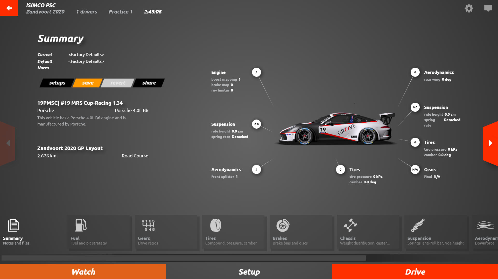
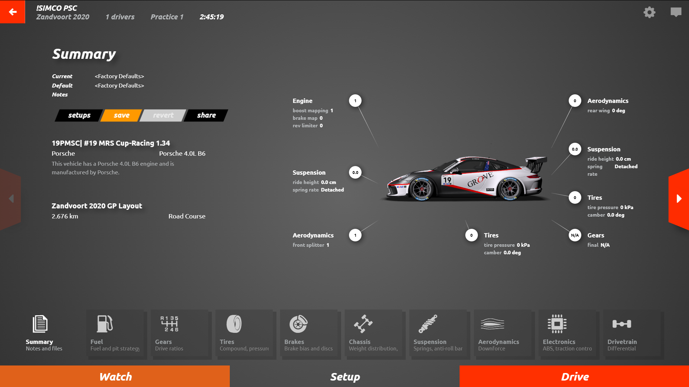

# rf2-better-ui
In this repository you can find small modifications for the new rFactor 2 UI

# How to install
1. Locate your rFactor 2 install directory
2. Backup files under rFactor 2\Bin\Bundles
3. Download modified bundle jar files
4. Copy and overwrite original files
5. Start rFactor 2 & enjoy

# How to uninstall
- Restore your backup files
- OR let Steam re-download modified files: https://support.steampowered.com/kb_article.php?ref=2037-QEUH-3335

# Features
- add left and right arrow navigation to the main screen
- fix z-index issue with "exit game" button
- add remember password feature to favorite multiplayer servers
- add left and right arrow navigation to the race screen
- add left and right arrow navigation to the garage screen
- fix too big tiles on garage screen
- add permanent chat window below camera view

Before                                                      |  After
:----------------------------------------------------------:|:----------------------------------------------------------:
  |  

Swagger UI location:
https://amdatu.org/components/amdatu-web/
http://localhost:5396/swagger/index.html
